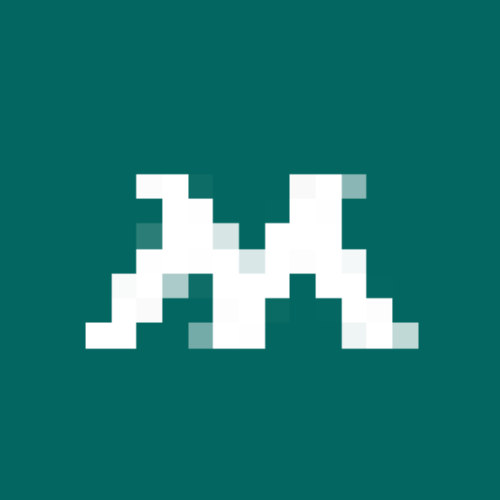

# 🏥 My Software - Digital Solutions

**My Software - Digital Solutions** is a promotional website designed to showcase digital solutions for businesses and healthcare providers, emphasizing accessibility, security, and user engagement.

---

## 🏢 Corporate Identity
Our company is committed to delivering cutting-edge digital solutions that prioritize accessibility, security, and user engagement.

### 🔹 Logo
Our brand logo represents innovation and accessibility.  

### 🔹 Mission Statement
*"Empowering businesses and individuals with accessible, secure, and innovative digital solutions."*

## 📌 Features

✅ **Modern & Responsive UI** - Fully optimized for mobile & desktop.  
✅ **Interactive Animations** - Smooth fade-in, scroll effects & hover transitions.  
✅ **Contact Section with Social Media Links** - Direct links to Facebook, Instagram, and LinkedIn.  
✅ **Informative Pages**:
  - **🏠 Homepage:** Introduction & services overview.
  - **📖 About Us:** Company mission & values.
  - **👨‍💼 Our Team:** Meet the team members.
  - **💡 Expertise:** Showcasing our expertise in software & digital health.
  - **🎗 National Day:** Awareness page for Mental Health.
  - **📞 Contact Us:** Get in touch via email & social media.

---

## 🎯 How This Website Meets Task B1
This website is designed to **advertise and promote My Software - Digital Solutions** by incorporating:
- ✅ **Corporate Identity** (Logo, Mission Statement, Branding)
- ✅ **Service Offerings** (Software Development, UI/UX Consulting, Digital Health Solutions)
- ✅ **Interactive Elements** (Animations, Smooth Transitions, Contact Forms)
- ✅ **Clear Navigation & User Engagement** (Easy access to About Us, Services, and Contact Info)
- ✅ **Deployed & Accessible** via Netlify for easy client access.

## 🚀 Technologies Used

- **Frontend**: HTML, CSS, JavaScript  
- **Styling**: CSS3 (Flexbox, Grid, Animations)  
- **Deployment**: Hosted on **Netlify**  
- **Local Development**: Python HTTP Server  

---

🚀 Installation & Running Locally

1️⃣ Clone the Repository

To clone this repository, run:

git clone https://github.com/walidgrw/mysoftwarepromotion.git

cd mysoftware-nhs

2️⃣ Run Locally with Python

To start a local server, run:

python -m http.server 8000

Then, open http://localhost:8000/ in your browser.

---
## 🏥 Promotion Website made by Walid Graihim (Marketing)

📞 Contact Information

👤 Team Leader: Jeremy Garside

📧 Email: bi51oa@student.sunderland.ac.uk

🌍 Website: [mysoftwaresun.netlify.app](https://mysoftwaresun.netlify.app/)
